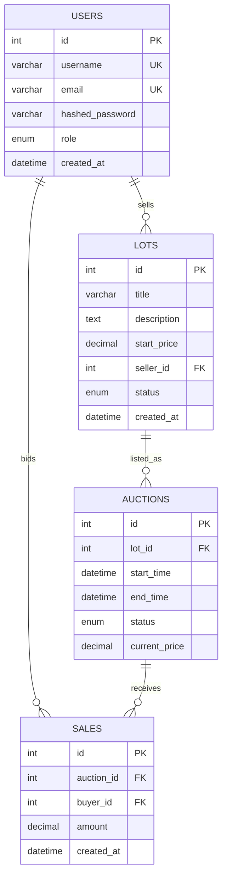

# ERD

## Связи

- один пользователь-продавец может создать несколько лотов;
- один лот может иметь несколько аукционов последовательно;
- один аукцион принимает несколько ставок;
- одна ставка принадлежит одному покупателю и одному аукциону.
